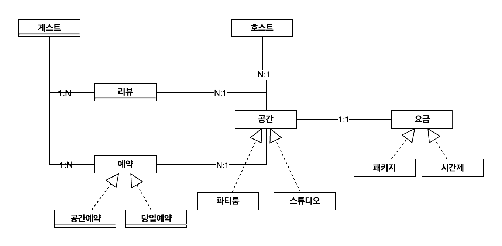
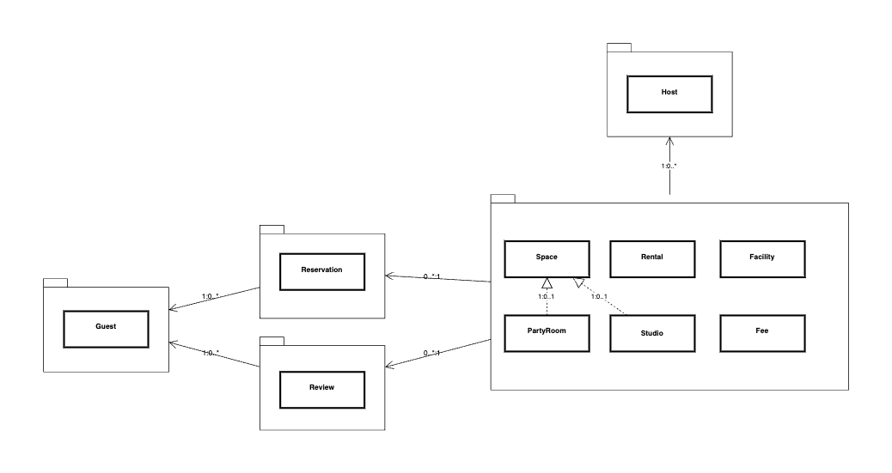
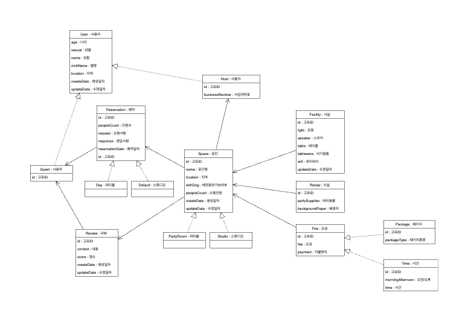
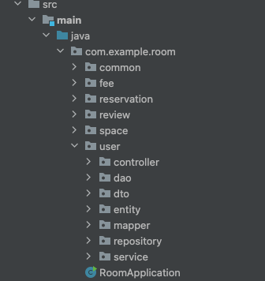

# Space_Reservation_Toy_Project
`공간 예약 시스템`을 모티브하여 설계 및 구현 하는 토이 프로젝트입니다.

---
### 기술 스택
* `Java11`
* `Spring Boot 2.7.11`
* `Junit5`
* `Gradle`
* `Spring Security`
* `JPA`
* `JWT`

### 프로세스 정리
`호스트`
1. 공간을 생성한다.
2. 예약 요청온 공간을 조회한다.
3. 예약 요청을 수락 혹은 거절한다.

`게스트`
1. 공간 목록을 조회한다.
2. 공간 상세 조회한다.
3. 공간 예약 요청을 한다.
4. 예약을 취소한다.
5. 예약 캔슬시 패널티가 추가된다.
6. 예약일 이후 리뷰를 남긴다.

---
# 설계
## 1. 엔티티별 관계도

1. 대략적으로 엔티티 간의 관계와 확장될 수 있는 엔티티의 상속 관계를 표현 하였습니다.

## 2. 엔티티 패키지 정의

1. 같은 패키지에 엔티티들은 같은 라이프사이클을 갖고 있습니다.
2. 같은 패키지에 엔티티들은 객체 그래프를 통하여 참조하고, 타 패키지 간에는 Id 참조하고 있습니다.

## 3. 엔티티 필드 정의

1. 엔티티에서 필요한 필드들을 정의 하였습니다.
2. 엔티티간의 참조를 표시 하고, 순환 참조 되거나 어색한 부분이 있는지 체크 하였습니다.

## 4. 패키지 구조
 
일반적으로 웹 계층형 구조를 많이 사용하며, 투입된 프로젝트에서도 웹 계층형 구조를 사용하였습니다. 
구조가 단순하기 때문에 전체적인 구조 파악은 빠를 수 있으나 패키지에 많은 클래스 파일들이 존재 하여, 그 수가 늘어날 수록 장점이 쇠퇴됩니다. 
OOP 관점, ORM 사용함에 있어 도메인 기반으로 패키징하는 것이 기술 관점, 지향점과 맞다고 생각 되어 도메인 계층형 구조를 선택 하였습니다. 

## 5. UML 변경된 사항들

### `User 패키지 통합`
GUEST, HOST 별도의 도메인으로 작성 하였던 것을 User 도메인 하위 엔티티로 두었고 통합하였습니다. 
이유는 회원가입, 로그인, 로그아웃, 회원탈퇴 등 같은 사이클을 갖고 있는 두 도메인을 나눌 필요가 없다고 판단되었습니다. 

### `공간 파티룸과 스튜디오 Entity -> Enum`
Space 엔티티의 하위 SpacePartyRoom, SpaceStudio 의 엔티티를 제거 하였고 Enum 타입을 두었습니다. (제거 된 두 엔티티는 별도의 비즈니스 로직이나 상태값을 갖고 있지 않아 굳이 분리할 이유가 없다 판단하였습니다.)  

### `Rental,Facility -> Space 하위 엔티티로 변경`
Space - Facility - Rental 은 하나의 라이프 사이클을 갖고 움직입니다.

### `Field 재정의 후 업데이트 예정입니다.`
Field 변경은 추후 업데이트 예정입니다.

