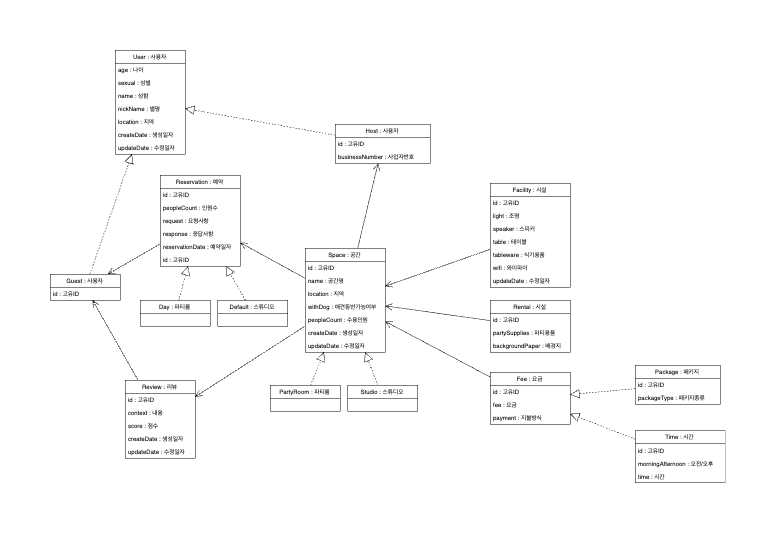
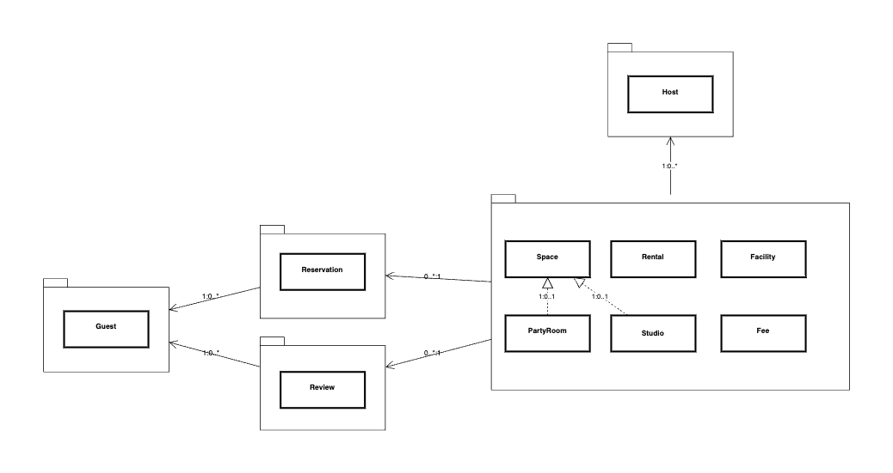

## 도메인 모델링

### UML

* 위는 공간 예약과 리뷰 서비스의 도메인 모델링 한 결과 입니다.
* 도메인별 관계는 (아래,왼쪽) : (위, 오른쪽) 표시하였습니다.
### 프로세스 정리
호스트 프로세스
1. 공간을 생성한다.
2. 공간을 조회한다. (등록순,수정순)
3. 공간을 수정한다.
4. 예약 요청온 공간을 조회한다.
5. 예약 요청을 거절한다.
6. 예약 요청을 수용한다.

게스트 프로세스
1. 공간 목록을 조회한다. (등록순,수정순,지역, 애견동반,수용가능인원,시설여부,렌탈여부,금액이상이하,금액타입,예약가능일자,공간 타입)
2. 공간 상세 조회한다.
3. 공간 예약 요청을 한다.
4. 예약을 취소한다.
5. 예약 캔슬시 패널티가 추가된다.
6. 이용 후 리뷰를 남긴다.

1. 게스트와 공간의 다대다 관계를 예약, 리뷰 도메인으로 일대다 다대일 관계로 풀어 냈습니다.
   (JPA에서 다대다를 지양하는 이유는 다음과 같습니다.
   - 중간 테이블의 필요성
   다대다 관계를 표현하기 위해 중간 테이블(조인 테이블)이 필요합니다. 이 중간 테이블에는 다른 테이블의 외래키가 모두 포함되어 있습니다. 이러한 중간 테이블은 객체지향적인 모델링과 관계형 데이터베이스의 모델링 간의 차이를 유발시킵니다. 이로 인해 코드를 복잡하게 만들어 테스트와 유지보수를 어렵게 합니다.

   - 데이터 무결성
   다대다 관계를 사용하면 중간 테이블의 데이터 무결성을 유지하기 위해 복잡한 코드가 필요합니다. 예를 들어, 중간 테이블에서 한 쪽 외래키를 삭제할 때 다른 쪽 외래키도 함께 삭제해야 합니다. 이러한 작업은 JPA에서 자동으로 수행되지 않으므로 개발자가 별도로 구현해야 합니다.

   - 성능
   다대다 관계를 사용하면 데이터를 가져오는 데 많은 JOIN 작업이 필요합니다. JOIN 작업은 성능에 부정적인 영향을 미칠 수 있습니다. 또한, 다대다 관계를 사용할 경우 중간 테이블의 레코드가 매우 많아질 수 있습니다. 이는 성능에 더 큰 영향을 미칩니다.

   따라서, JPA에서는 다대다 관계를 지양하고 일대다, 다대일 관계를 사용하는 것을 권장합니다. 이를 통해 코드의 복잡성을 줄이고 데이터 무결성을 보장하며, 성능도 개선할 수 있습니다.

2. 
3. 

공간-요금 한 사이클 엔티티 분리
요금-예약 한 사이클
공간 - 시설 - 렌탈은 하나의 라이프 사이클을 돌기에 수정하였습니다.

## 기술 스택
* JPA
* Java11
* Spring Boot 2.7.11
* Junit5

## 패키지 구조
* 일반적으로 웹 계층형 구조를 많이 사용하며, 투입된 프로젝트에서도 웹 계층형 구조를 사용하였습니다. 
구조가 단순하기 때문에 전체적인 구조 파악은 빠를 수 있으나 패키지에 많은 클래스 파일들이 존재 하여, 그 수가 늘어날 수록 장점이 쇠퇴됩니다. 
저는 OOP 관점, ORM을 사용함에 있어 Domain 기반으로 패키징하는 것이 기술 관점, 지향점과 맞다고 생각 했으며, 직관적이며 계층간의 분리가 확실한 도메인 계층형 구조를 선택 하였습니다.

#### TODO
- 엔티티 설계 및 구현

- 리뷰 공간 1:1
-  
