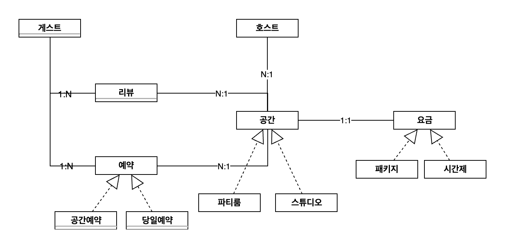

## 도메인 모델링

### UML

* 위는 공간 예약과 리뷰 서비스의 도메인 모델링 한 결과 입니다.
* 도메인별 관계는 (아래,왼쪽) : (위, 오른쪽) 표시하였습니다.

1. 게스트와 공간의 다대다 관계를 예약, 리뷰 도메인으로 일대다 다대일 관계로 풀어 냈습니다.
2. 

## 기술 스택
* JPA
* Java11
* Spring Boot 2.7.11
* Junit5

## 패키지 구조
* 일반적으로 웹 계층형 구조를 많이 사용하며, 투입된 프로젝트에서도 웹 계층형 구조를 사용하였습니다. 
구조가 단순하기 때문에 전체적인 구조 파악은 빠를 수 있으나 패키지에 많은 클래스 파일들이 존재 하여, 그 수가 늘어날 수록 장점이 쇠퇴됩니다. 
저는 OOP 관점, ORM을 사용함에 있어 Domain 기반으로 패키징하는 것이 기술 관점, 지향점과 맞다고 생각 했으며, 직관적이며 계층간의 분리가 확실한 도메인 계층형 구조를 선택 하였습니다.

#### TODO
- 엔티티 설계 및 구현

- 리뷰 공간 1:1
-  
